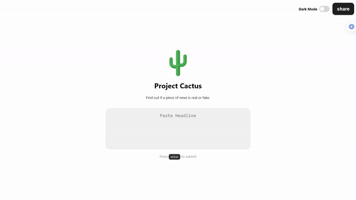

<div id="top"></div>

<!-- PROJECT SHIELDS -->
<!--
*** I'm using markdown "reference style" links for readability.
*** Reference links are enclosed in brackets [ ] instead of parentheses ( ).
*** See the bottom of this document for the declaration of the reference variables
*** for contributors-url, forks-url, etc. This is an optional, concise syntax you may use.
*** https://www.markdownguide.org/basic-syntax/#reference-style-links
-->
[][contributors-url]
[][forks-url]
[][stars-url]
[][license-url]


<!-- PROJECT LOGO -->
<br />
<div align="center">
  <a href="https://github.com/Ducksss/Project-Cactus">
    
  </a>

<h3 align="center">Project Cactus</h3>

  <p align="center">
    A cross-platform AI Fake News Detector
    <br />
    <br />
    <a href="https://project-cactus-c9549.web.app/">Demo Website</a>
    ·
    <a href="https://github.com/Ducksss/Project-Cactus/issues">Report Bugs</a>
    ·
    <a href="https://github.com/Ducksss/Project-Cactus/issues">Request Features</a>
  </p>
</div>


<!-- TABLE OF CONTENTS -->
<details>
  <summary>Table of Contents</summary>
  <ol>
    <li>
      <a href="#about-the-project">About The Project</a>
      <ul>
        <li><a href="#built-with">Built With</a></li>
      </ul>
    </li>
    <li>
      <a href="#getting-started">Getting Started</a>
      <ul>
        <li><a href="#prerequisites">Prerequisites</a></li>
        <li><a href="#installation">Installation</a></li>
      </ul>
    </li>
    <li><a href="#usage">Usage</a></li>
    <li><a href="#roadmap">Roadmap</a></li>
    <li><a href="#contributing">Contributing</a></li>
    <li><a href="#license">License</a></li>
    <li><a href="#contact">Contact</a></li>
    <li><a href="#References">References</a></li>
  </ol>
</details>


<!-- ABOUT THE PROJECT -->
## About The Project

<a href="https://project-cactus-c9549.web.app/"></a>

The past few years have seen a surge in the spread of fake news, and it's increasing impact on our daily lives. Unfortunately, the flood of fake news online has made it difficult and tiring for people to fact check what they see online. 

Project Cactus is a cross-platform web app and extension that uses the power of deep learning to warn you about fake news. Cactus looks at the headlines any article you send it, and warns you if it thinks the article contains potentially misleading information. From there, you'll be warned, and can double check on the source before you ingest it.

This is all accomplished using a state of the art recurrent neural network, which has learnt from a massive assortment of recent news articles, both real and fake.

Cactus is powered by a Tensorflow model hosted on the [Google Cloud AI Platform](https://cloud.google.com/vertex-ai) and deployed with [Heroku](https://www.heroku.com).

<p align="right">(<a href="#top">back to top</a>)</p>


### Built With

* [Vue.js](https://vuejs.org/)
* [Tensorflow](https://www.tensorflow.org/)
* [Keras](https://keras.io/)
* [Heroku](https://www.heroku.com)
* [Firebase](https://firebase.google.com/)
* [Google Cloud AI Platform](https://cloud.google.com/vertex-ai)

<p align="right">(<a href="#top">back to top</a>)</p>


<!-- GETTING STARTED -->
## Getting Started

Cactus is currently accessible via two different platforms, as a [Progressive Web Application](https://project-cactus-c9549.web.app/) and [Browser Extension(Twitter.com)](https://github.com/Ducksss/Project-Cactus/tree/main/extension).

### Progressive Web Application

1. Visit [Live Demo Page](https://project-cactus-c9549.web.app/) hosted on [Firebase](https://firebase.google.com/).

or *(to host locally)*

1. Clone the repo.
   ```sh
   git clone https://github.com/Ducksss/Project-Cactus.git
   ```
2. Navigate to `pwa/dist`
    ```sh
    cd pwa/dist
    ```
3. Open `index.html` and Start Browsing!

### Browser Extension

1. Clone the repo.
   ```sh
   git clone https://github.com/Ducksss/Project-Cactus.git
   ```
2. Visit the Extension Settings Page from your Chromium Browser.
   ```sh
   chrome://extensions/
   ```
3. Enable Developer Mode.
4. Load and Enable the extension from the `extension` folder in this repo.
5. Visit `https://twitter.com/` and Start Browsing!
*(Cactus will be supported for more Social Media sites in the future!)*

<p align="right">(<a href="#top">back to top</a>)</p>


<!-- USAGE EXAMPLES -->
## Usage

Use this space to show useful examples of how a project can be used. Additional screenshots, code examples and demos work well in this space. You may also link to more resources.

_For more examples, please refer to the [Documentation](https://example.com)_

<p align="right">(<a href="#top">back to top</a>)</p>


<!-- ROADMAP -->
## Roadmap
- [ ] Extension support for other social media platforms
- [ ] Support for other languages (e.g. Chinese)
- [ ] Improvements on the AI model
    - [ ] Improvements on inference speed via weight pruning and model quantization
    - [ ] Improvements on network architecture for even better predictions
- [ ] Ability for Cactus to suggest trustworthy sources related to a given fake news article


See the [open issues](https://github.com/Ducksss/Project-Cactus/issues) for a full list of proposed features (and known issues).

<p align="right">(<a href="#top">back to top</a>)</p>


<!-- CONTRIBUTING -->
## Contributing

Contributions are what make the open source community such an amazing place to learn, inspire, and create. Any contributions you make are **greatly appreciated**.

If you have a suggestion that would make this better, please fork the repo and create a pull request. You can also simply open an issue with the tag "enhancement".
Don't forget to give the project a star! Thanks again!

1. Fork the Project
2. Create your Feature Branch (`git checkout -b feature/AmazingFeature`)
3. Commit your Changes (`git commit -m 'Add some AmazingFeature'`)
4. Push to the Branch (`git push origin feature/AmazingFeature`)
5. Open a Pull Request

<p align="right">(<a href="#top">back to top</a>)</p>


<!-- LICENSE -->
## License

Distributed under the MIT License. See `LICENSE.txt` for more information.

<p align="right">(<a href="#top">back to top</a>)</p>


<!-- CONTACT -->
## Contact

- Wong Zhao Wu (Backend API Developer & Data Curator) - [LinkedIn](https://twitter.com/twitter_handlehttps://www.linkedin.com/in/zhao-wu-wong-27b434201/) - zhaowu.wong@gmail.com

- Oh Tien Cheng (Machine Learning Engineer) - [LinkedIn](https://www.linkedin.com/in/ohtiencheng/) - tiencheng@pm.me

- Ong Zheng Kai (Web Developer & Backend API Developer) - [LinkedIn](https://www.linkedin.com/in/zheng-kai-ong-211817200/) - ozk.zhengkai@gmail.com

- Chai Pin Zheng (Web Extension Developer) - [LinkedIn](https://www.linkedin.com/in/chai-pin-zheng-5610921aa/) - chaipinzheng@gmail.com

Project Link: [https://github.com/Ducksss/Project-Cactus](https://github.com/Ducksss/Project-Cactus)

<p align="right">(<a href="#top">back to top</a>)</p>

<!-- References -->
## References

- [pmacinec/COVID-19-rumor-dataset](https://github.com/MickeysClubhouse/COVID-19-rumor-dataset/blob/master/Data/news/news.csv)
- [KaiDMML/FakeNewsNet](https://github.com/KaiDMML/FakeNewsNet/tree/master/dataset)
- [Fake and real news dataset](https://www.kaggle.com/clmentbisaillon/fake-and-real-news-dataset)
- [FakeCovid](https://github.com/Gautamshahi/FakeCovid)
- [Readme-Template](https://github.com/othneildrew/Best-README-Template)

<p align="right">(<a href="#top">back to top</a>)</p>


<!-- MARKDOWN LINKS & IMAGES -->
<!-- https://www.markdownguide.org/basic-syntax/#reference-style-links -->
[contributors-shield]: https://img.shields.io/github/contributors/Ducksss/Project-Cactus.svg?style=for-the-badge
[contributors-url]: https://github.com/Ducksss/Project-Cactus/graphs/contributors
[forks-shield]: https://img.shields.io/github/forks/Ducksss/Project-Cactus.svg?style=for-the-badge
[forks-url]: https://github.com/Ducksss/Project-Cactus/network/members
[stars-shield]: https://img.shields.io/github/stars/Ducksss/Project-Cactus.svg?style=for-the-badge
[stars-url]: https://github.com/Ducksss/Project-Cactus/stargazers
[issues-shield]: https://img.shields.io/github/issues/Ducksss/Project-Cactus.svg?style=for-the-badge
[issues-url]: https://github.com/Ducksss/Project-Cactus/issues
[license-shield]: https://img.shields.io/github/license/Ducksss/Project-Cactus.svg?style=for-the-badge
[license-url]: https://github.com/Ducksss/FakeNews/blob/main/LICENSE
[linkedin-shield]: https://img.shields.io/badge/-LinkedIn-black.svg?style=for-the-badge&logo=linkedin&colorB=555
[linkedin-url]: https://linkedin.com/in/linkedin_username
[product-screenshot]: images/screenshot.png
